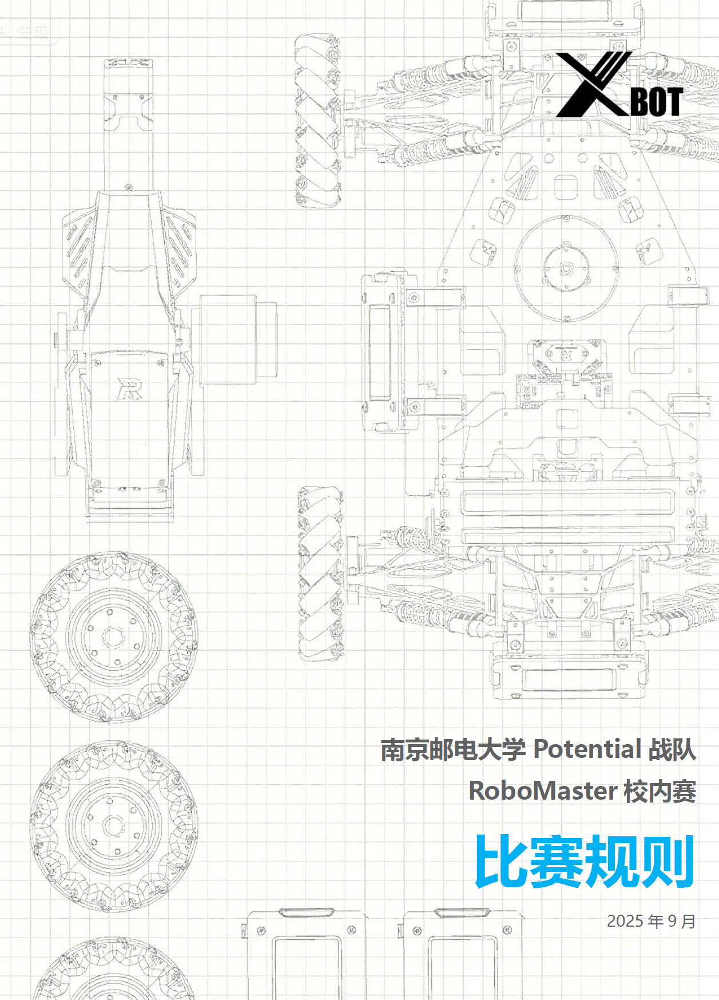

# 南京邮电大学RoboMaster校内赛开源资料

## 1. 简介

本仓库开源了**南京邮电大学RoboMaster校内赛**的完整赛事资料。

在校内赛中，参赛队伍需制作具备水弹发射能力的小车，参与射击对抗赛。

> 校内赛混剪；https://www.bilibili.com/video/BV1rbUkBVELW
>
> 校内赛录制（带解说）：https://www.bilibili.com/video/BV1k1C9BYEXR

开源资料包括以下四个部分：

- 裁判系统

- 比赛规则

- 奖杯

- 视觉设计

### 1.1 裁判系统

裁判系统由**南京邮电大学Potential战队**自行设计研发，包括以下三个部分：

- 装甲板（带**击打检测**和**数据回传**功能）
  - 装甲板程序：https://github.com/njupt-robomasters/SmallMasterArmor

- 图传模块（某宝WiFi图传改外壳）
- 客户端软件（包括**选手端**和**裁判端**）
  - 选手端：https://github.com/njupt-robomasters/SmallMasterClient
  - 裁判端：https://github.com/njupt-robomasters/SmallMasterReferee

装甲板：

图传模块：

选手端：

裁判端：

## 1.2 比赛通知

[RoboMaster校内赛比赛规则.md](比赛规则/RoboMaster校内赛比赛规则.md)

[RoboMaster校内赛比赛规则.pdf](比赛规则/RoboMaster校内赛比赛规则.pdf)

[RoboMaster校内赛比赛规则.docx](比赛规则/RoboMaster校内赛比赛规则.docx)

## 1.3 奖杯

获奖前三名奖杯样式相同，第一、第二、第三名分别颁发金色、银色、铜色奖杯

另设最佳人气奖， 颁发独特的奖杯

## 2.4 视觉设计

## 3. 使用指南

1. 获得学校支持（场地和经费）
2. 复刻**裁判系统**（包括PCB、3D模型、裁判系统软件），测试裁判系统正常运行
3. 修改**比赛规则**，如赛事时间与奖项设置
4. 按比赛规则执行赛事流程

## 4. 鸣谢

- 南京邮电大学
- 松灵机器人
- 指导老师：昂阳
- 策划：张乔楚
- 主裁判组：王政权  谷天乐  黄子轩
- 检录裁判：杨杰
- 边场裁判：王怀磊  王禹智 柯希东  马旺塔  林余宣
- 解说：孔德浩  苑尚坤
- 直播与技术保障：甘宇铮  徐俊豪
- 灯光：刘泽天
- 视觉设计：陈骁睿 
- 志愿者：赵雨杨 吴育奋 等

感谢所有参赛选手的精彩表现，感谢志愿者同学们的辛勤付出

## 5. 合作

如果你也希望在贵校举办类似的RoboMaster校内赛，或者希望与我们共同探讨赛事组织、技术规格及配套系统的优化，欢迎随时联我们。

联系方式：3054762097@qq.com
