# 🏆 RoboMaster校内赛 比赛规则

## 📑 目录

* **1 比赛介绍**  
* **2 参赛要求**  
* **3 参赛流程**  
  * **3.1 比赛报名**  
  * **3.2 作品制作**  
  * **3.3 规则测评**  
  * **3.4 完整形态考察**  
  * **3.5 开源审查**  
    * **3.5.1 报告提交**  
    * **3.5.2 线下审查**  
  * **3.6 机器人射击对抗赛**  
    * **3.6.1 适应性训练**  
    * **3.6.2 决赛**  
  * **3.7 奖项评定**  
    * **3.7.1 一二三等奖评定规则**  
    * **3.7.2 人气奖评选规则**  
  * **3.8 奖励发放**  
* **4 奖项设置**  
* **5 机器人制作规范**  
  * **5.1 能源**  
  * **5.2 通讯手段**  
  * **5.3 光学手段**  
  * **5.4 视觉特征**  
  * **5.5 外观设计**  
  * **5.6 发射机构**  
  * **5.7 机器人技术规范**  
  * **5.8 装甲板模块安装规范**  
    * **5.8.1 方向规范**  
    * **5.8.2 装甲模块安装**  
    * **5.8.3 机器人变形**  
* **6 学长导师制**  
* **7 开源审查**  
  * **7.1 充分再设计**  
  * **7.2 非充分再设计**  
  * **7.3 无效再设计**  
* **8 裁判系统**  
  * **8.1 装甲板模块**  
  * **8.2 图传模块**  

---

# 1. 比赛介绍

参赛者需自主设计可发射水弹的智能小车，完成机械组装、电路设计和程序调试等任务，在紧张刺激的对抗赛中一决高下。比赛旨在培养学生的工程实践能力、创新思维和团队协作精神， 同时为机器人爱好者提供展示才华的舞台。优秀参赛者将有机会获得**Potential战队**（南京邮电大学RoboMaster战队）的青睐，踏上更高层级的科创征途。

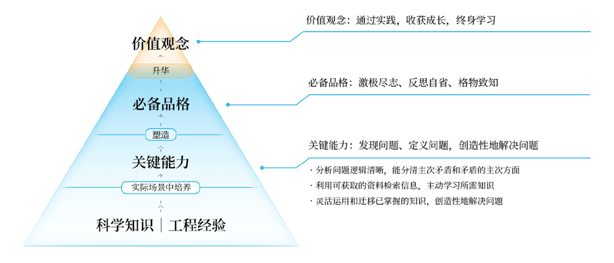

# 2. 参赛要求

-  **参赛资格：**
  - **选手要求：**参赛者须为**南京邮电大学2025级大一新生**。
  - **组队规则：**比赛须以团队形式报名，**每支队伍人数为3人**。
  - **组队建议：每人限参加一支队伍**。鼓励跨学院、跨专业组队以实现技术互补。
  
- **赛事时间：2025年9月14日至11月15日**

- **报名通道：**参赛队伍需加入赛事官方QQ群（**下图扫描进群，群号：xxx**），并填写群内发布的报名表。

- **作品规范：**
  - **核心任务：**参赛队伍需要自主设计并制作具备**水弹射击**功能的**小车**。
  - **技术标准：**作品须遵守机器人制作规范，并**安装比赛指定的“裁判系统”**。
  
- **评比流程：**依次为 **规则测评、完整形态考察、开源审查、机器人射击对抗赛**。

  

# 3. 参赛流程

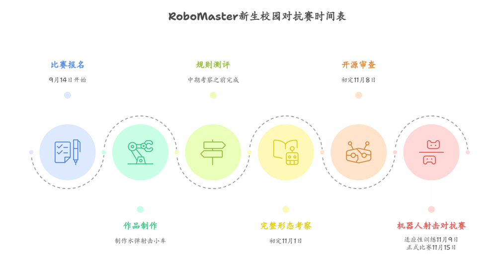

## 3.1 比赛报名

- **报名开启：9月14日！**

- **报名通道：加入官方QQ群**，比赛通知将在群内发布，参赛队伍需及时**填写群内报名表**，积极关注群内关于各个参赛环节的通知。

- **战队配置：每支队伍人数为3人**，每人只能加入一支队伍，**每支队伍可有学长导师**（详见 6. 学长导师制）

*tips：对于较早报名的队伍，在裁判系统借用等环节中可获得更高的优先级，因此建议各队伍尽早报名。*

## 3.2 作品制作

本赛事要求参赛队伍自主设计出一台可以实现**移动、瞄准、发射水弹的小车**。小车还需要**安装由组委会提供的“裁判系统”**（详见 8. 裁判系统）。

比赛组委会将提供一套开源小车图纸供参赛队伍参考（如下图），参赛队伍可自由借鉴和创新。

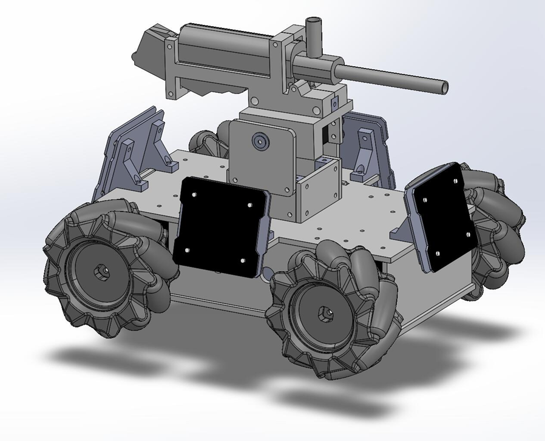

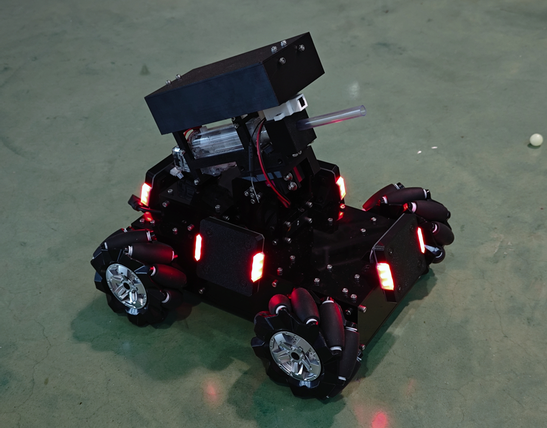

**水弹小车主要结构：**

-  底盘：轮组（轮子和电机，上图中小车使用麦克纳姆轮和步进电机），电器仓，装甲板模块（裁判系统的一部分）

-  云台：Pitch轴（俯仰轴，控制抬头和低头），Yaw轴（控制云台水平旋转，上图小车无Yaw轴），水弹发射器

**注意：**

1. 作品制作过程中，需遵守机器人制作规范（详见 5. 机器人制作规范）。
2. 赛事设立“**学长导师制**”，参赛队伍可以向“学长导师”请教以获得作品制作上的建议和帮助。
3. 参赛队伍需收集并留存小车的制作过程及相关资料，以此为依据撰写作品报告。

**下表列举了部分小车组件的制作建议**

| **小车组件**     | **制作建议**                                                 | **官方开源小车方案**                       |
| ---------------- | ------------------------------------------------------------ | ------------------------------------------ |
| **板材**         | 推荐使用 3D 打印件或玻纤板（需要自己画图，在淘宝上找商家加工） | 亚克力板和 3D 打印件                       |
| **标准件**       | 各种尺寸的螺丝和螺母，六面螺母，轴承（如法兰轴承）           | 螺丝螺母，六面螺母，法兰轴承               |
| **电机**         | 有刷减速电机，步进电机，舵机，无刷电机......                 | 步进电机                                   |
| **电机驱动**     | 步进电机开环驱动器（如 A4988 / TMC2209）、步进电机闭环控制器（性能很强，但价格稍贵）、TB6612（直流有刷驱动器）...... | A4988                                      |
| **轮子**         | 麦克纳姆轮，全向轮，舵轮......                               | 麦克纳姆轮                                 |
| **水弹发射模块** | 水弹发射器（淘宝搜索：波箱）                                 |                                            |
| **主控**         | ESP32 核心板，STM32 核心板，Arduin- 核心板（性能较差，不建议） | Makerbase MKS TinyBee 主板（芯片为 ESP32） |
| **电路板与接线** | 杜邦线，面包板（易于调试，但不稳定，不建议上场使用），手工焊接洞洞板，画 PCB（可在嘉立创进行设计与免费打板） |                                            |

## 3.3 规则测评

**时间：完整形态考察之前完成**

规则测评采用线上题库答题的方式，参赛队伍可多次提交，取最高成绩。此项成绩计入完整形态考察的分数。

规则测评的考察内容涵盖：比赛规则、机器人制作规范、裁判系统的使用。

## 3.4 完整形态考察

**时间：11月1日（正式比赛前的第二个周六）**

完整形态考察采用线下测评的方式，评分项目如下：

| 类别         | 考察内容     | 具体要求                   | 分值 |
| :----------- | :----------- | :------------------------- | :--- |
| **底盘部分** | 直线运动     | 沿宽度受限的道路行进 5m    | 15   |
| **底盘部分** | 原地旋转     | 在规定范围内持续旋转 10s   | 15   |
| **底盘部分** | 全向运动     | 完成前后左右平移           | 15   |
| **云台部分** | 俯仰运动     | 云台俯仰运动范围超过 30°   | 15   |
| **云台部分** | 发射水弹     | 可连续发射水弹 10s，不卡弹 | 15   |
| **云台部分** | 击打固定靶   | 30s 命中 5 次固定靶        | 15   |
| **其他**     | 队伍自行决定 | 其他有助于比赛的功能       | 10   |

上述得分与规则测评得分加和，排名前16的队伍获得正式比赛资格，同时获得裁判系统借用资格。

剩余队伍中排名前2的队伍可获得三等奖，其余队伍淘汰。

## 3.5 开源审查

**时间：11月8日（正式比赛前的第一个周六）**

完整形态考察分为：报告提交、线下审查两部分。

### 3.5.1 报告提交

**参赛队伍需要在11月7日之前提交作品报告。**报告是开源审查的重要参考，各队伍应在报告中充分体现自己的创新性设计。粗糙的报告可能会无法体现作品的创新部分，进而影响开源审查的评级。

**作品报告除文字内容外，还将包括以下内容：**

1. 小车的宣传照片、队伍形象照片
  1. 拍摄时需要考虑到照片的宣传作用，选择合适的背景、光线与设备，有条件的队伍可以使用单反相机拍摄，不建议随手拍的照片。
  2. 队伍形象照片为：所有队员与作品的合影

2. 作品制作过程中的证明材料

   1. 3D建模、程序设计等设计或制作过程的照片或视频。

   2. 队员在制作小车时的照片，需要实时拍摄，不可摆拍。

### 3.5.2 线下审查

在提交报告后，所有参赛队伍还需要参加线下实物审查及技术答辩。

-  **审查形式：**参赛团队需现场展示作品**设计思路**、**创新亮点与实际成果**，并且就评委的针对性提问进行现场答辩。

- **评价权重：**选手的逻辑表达、对技术细节的掌握程度，将决定**开源审查**的最终得分。

- **评级定义：**各队伍的作品将被评级为：充分再设计、非充分再设计、无效再设计。

（详见：7. 开源审查）

**只有符合“充分再设计”的作品可以获得一等奖，仅符合“非充分再设计”的作品最高只能评二等奖，否则最高只可获得三等奖。**（详见：3.7 奖项评定）

## 3.6 机器人射击对抗赛

在通过前期各项技术审查后，参赛团队将进入最终的射击对抗赛阶段。本环节不仅是对机器人性能的极限测试，更是**最终奖项评定最为关键的量化指标**。

**1. 赛事构成**

对抗赛分为两个核心阶段，旨在确保比赛的公平性与竞技深度：

1. **适应性训练：** 提供规定时长的场地试运行机会，供团队进行传感调试、底盘校准及赛场环境适配。
2. **正式对抗赛：** 严格按照对阵表进行的积分/淘汰赛，通过实战检验操作手的战术素养与机器人的稳定性。

**2.  赛前检录：**

**每场比赛前都有严格的检录**，检录包括检查机器人是否符合制作规范、确保裁判系统的正常工作。检录不合格的队伍将面临限时整改，整改未果可能被取消该场比赛资格，请各支队伍做好准备。

**3. 赛制安排**

每场分为B-1、B-3、B-5三种赛制：

- B-1：每场比赛1轮

- B-3：每场比赛3轮，首先赢得2轮的队伍获胜

- B-5：每场比赛5轮，首先赢得3轮的队伍获胜

**4.  温馨提示**

每轮比赛准备时间2分钟，比赛时间3分钟。可在准备阶段装填弹丸，但不得在比赛过程中补弹。

### 3.6.1 适应性训练

**时间：11月9日（正式比赛前的第一个周日）**

各队伍随机抽签比赛（B-1赛制），此次比赛不作为评奖依据。

### 3.6.2 决赛

**时间：11月15日 上午9:00-13:00 下午14:00-18:00**

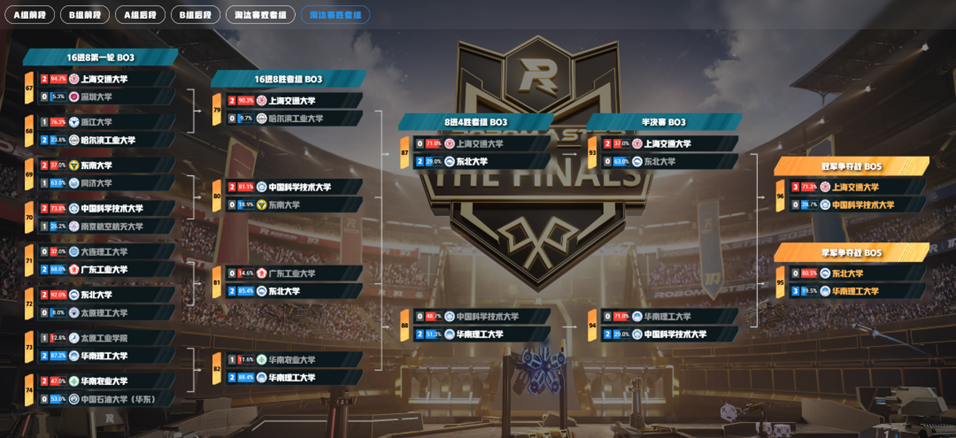

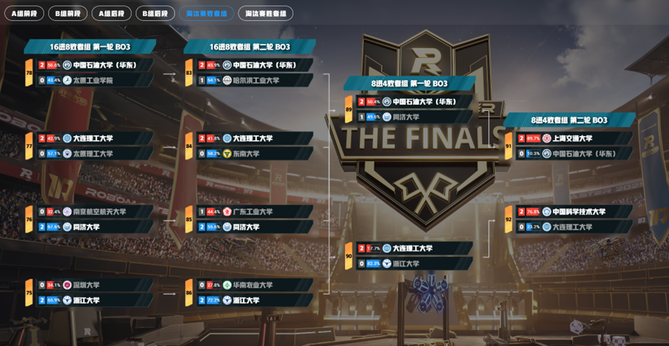

本阶段比赛采用**双败淘汰制与单败淘汰制相结合**的赛制。从16强至4强阶段为双败淘汰赛（采用B-3赛制），半决赛及决赛阶段为单败淘汰赛（采用B-5赛制）。参考流程如上图（RoboMaster全国赛赛制，选自[RoboMaster 赛程分析](https://schedule.scutb-t.cn/2025/572?gr-up=5)）所示，具体流程如下：

**第一阶段：16进8**

1. **首轮比赛**
   -  胜者进入**16进8胜者组**。
   -  败者落入**16进8败者组第一轮**。

2. **16****进8胜者组
   - 胜者进入**8进4胜者组**。
   - 败者落入**16进8败者组第二轮**。

3. **16****进8败者组**
   - 第一轮：胜者进入**16进8败者组第二轮**，败者淘汰。
   - 第二轮：胜者进入**8进4败者组第一轮**，败者淘汰。

**第二阶段：8进4**

1. **8****进4胜者组**
   - 胜者晋级**半决赛**。
   - 败者落入**8进4败者组第二轮**。

2. **败者组比赛**
   - 第一轮：胜者进入**8进4败者组第二轮**，败者淘汰。
   - 第二轮：胜者晋级**半决赛**，败者淘汰。

**第三阶段：总决赛**

1. **半决赛**
   - 胜者进入**冠军争夺战**。
   - 败者进入**季军争夺战**。

2. **季军争夺战**
   - 胜者为**季军**。
   - 败者为**殿军**。

3. **冠军争夺战**
   - 胜者为**冠军**。
   - 败者为**亚军**。

**比赛顺序：**

- 第一场比赛前，16支队伍抽签获得1~16编号

- 同一组内的比赛，按编号从小到大排序，依次两两比赛

- 不同组的比赛，按前文描述顺序依次进行

- 对于每一场比赛，编号较小的为红方，编号较大的为蓝方

## 3.7 奖项评定

比赛的奖项设置为：一等奖、二等奖、三等奖及人气奖（详见 4. 奖项设置）

**TIPS** **：**

- 人气奖为独立奖项，可与一、二、三等奖中的任一奖项同时获得，奖金可叠加发放

- 一、二、三等奖不可兼得

### 3.7.1 一、二、三等奖评定规则

评定依据：**主要参考对抗赛成绩，受开源审查结果制约。**

**开源审查的结果将决定获奖档次：只有符合“充分再设计”的作品可以获得一等奖，仅符合“非充分再设计”的作品最高只能评二等奖，否则最高只可获得三等奖。**

**排名规则：**

- 第一排序指标：冠军>亚军>季军>殿军>8强>16强

- 第二排序指标：队伍的总伤害数

**特殊说明：**

- 因开源审查未达标者，其奖项资格将顺延

- 若出现奖项评定相关的并列情况，由竞赛组委会仲裁决定

### 3.7.2 人气奖评选规则

**评选方式：**

- 正式比赛当日在备场区展示

- 现场观众投票评选

- 获奖比例不超过参赛队伍总数的15%

**投票规则：**

- 采用匿名投票，结束后公示得票数（不公开投票者信息）

- 投票者需现场参与，具体投票方式视情况而定

- 严禁刷票，违者取消所有获奖资格

## 3.8 奖励发放

**1.**  **奖杯**

决赛结束后，举行现场颁奖仪式，为冠、亚、季军颁发奖杯。

**2.**  **证书、奖金、自主个性化学分**

获奖名单将上报校团委，由校团委统一制作证书，并发放奖金和自主个性化学分。

# 4. 奖项设置

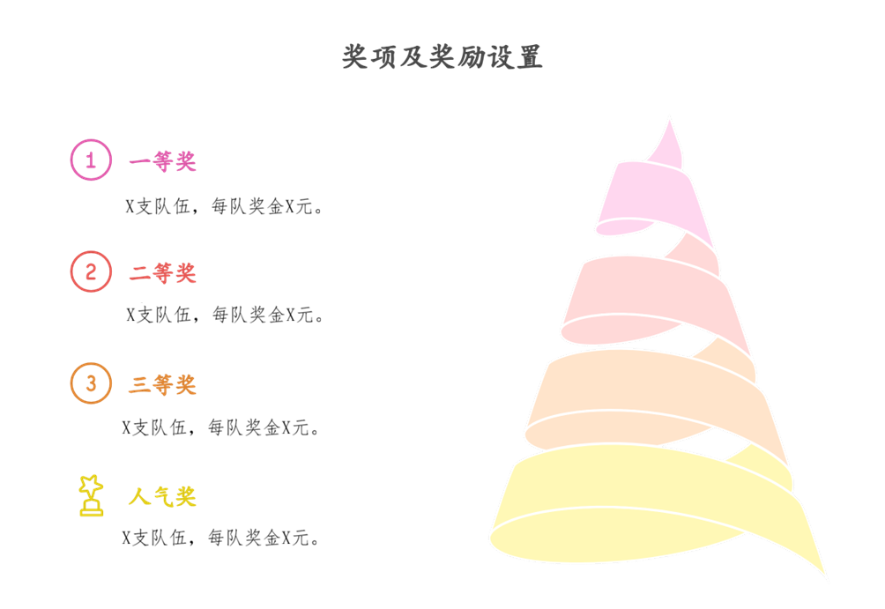

**一等奖：x支队伍，每队奖金x元，**颁发荣誉证书，给予自主个性化学分奖励。

**二等奖：x支队伍，每队奖金x元，**颁发荣誉证书，给予自主个性化学分奖励。

**三等奖：x支队伍，每队奖金x元，**颁发荣誉证书，给予自主个性化学分奖励。

**人气奖：x支队伍，颁发荣誉证书，给予自主个性化学分奖励。**

*TIPS：*

- *人气奖单独评比，可与一、二、三等奖（其一）同时获得，奖励叠加发放。*

- *根据最终参赛队伍数量，奖项可能会适当调整。*

# 5. 机器人制作规范

## 5.1   能源

- 机器人使用的能源形式仅限电池，且必须为正规厂家生产的干电池或锂电池。
- 机器人的能量传动方式仅允许电能与机械能。

*TIPS：不允许使用气动、液压等能源或能量传递方式。*

## 5.2   通讯手段

- 机器人可通过裁判系统下发的键鼠指令进行控制，或自行配备遥控器，遥控器可自制或者购买成品。建议使用裁判系统进行控制。

- 允许接入自己的图传，但要能兼容官方图传的协议。

- 禁止操作手目视场地操控小车，只能通过电脑屏幕上的图传画面对小车进行操控。

## 5.3   光学手段

- 机器人不得安装明显的可见光和不可见光发射设备。（机器人状态指示灯类的光源、红外传感器不视为明显的发光设备）

- 机器人使用任何光学手段都不应对任何人员造成身体伤害。

- 禁止安装发射可见光的激光产品，发射不可见光的激光产品需符合Class Ⅰ。

## 5.4   视觉特征

裁判系统装甲模块两侧有明显的灯光效果供机器人自动识别瞄准算法的开发。赛场及周围的环境比较复杂， 组委会无法保证比赛现场视觉特征不会造成视觉干扰，视觉算法应适应场地光线的变化与周边可能的其它干扰。

设计机器人时需遵循以下规范：

- 不得模拟机器人视觉特征 

- 不得使用任何手段改变机器人视觉特征。

*TIPS：机器人视觉特征为装甲模块两侧灯条。*

## 5.5   外观设计

为了防止机器人的外观设计影响赛场上射击对抗以及观赛体验，设计与制作机器人外观时需遵循以下规范：

- 机器人的线路整齐、不裸露，无法避免的外露线材需用束线管、理线器等材料进行保护。

- 机器人的外观中不得出现明显影响美观的材料，如塑料袋、床单气垫膜等。

- 不得设计或使用尖锐结构，以防造成场地破坏和人员伤害。

- 不得出现面积大于30mm*30mm红色或蓝色涂装

- 禁止不符合比赛精神的外观设计

*TIPS：建议参赛队伍采用不易破损的韧性材料进行保护壳制作，同时对保护壳进行可靠性测试，避免赛场上的对抗导致保护壳损坏，从而出现违规情况*

## 5.6   发射机构

- 发射发射机构是能够让弹丸以固定路径和一定初速度离开机器人的机构，机器人的发射机构需要能够稳定连续发射弹丸10s。

- 机器人的能量传动方式只允许电能与机械能的转化，禁止使用气动、液压装置进行发射机构的设计。

## 5.7   机器人技术规范

机器人需具备水平方向移动、发射水弹的功能，且做好防水措施。若在比赛过程中机器人因进水发生故障或造成安全事故自行承担后果。

机器人制作参数如下所示：

- 运行方式：仅限一个遥控机和裁判系统键鼠控制

- 最大供电电压（V）：30

- 发射机构：一个水弹发射器

- 最大初始尺寸（mm）：350\*350\*350

- 最大伸展尺寸（mm）：400\*400\*400

- 裁判系统：装甲板模块*4、图传模块*1

## 5.8   装甲板模块安装规范

### 5.8.1 方向规范

机器人机体坐标系是标准的X，Y，Z 笛卡尔坐标系，坐标原点为机器人的质量中心，以机器人所使用的底盘构型理论上最大效率方向为该机器人的X轴（若存在多个最大效率方向，则可任选一个方向作为 X 轴）和指向地心的 Z 轴正方向建立机器人坐标系。（机器人底盘是承载机器人动力系统及其附属部件的机构、支撑机器人机体的机构。）

多种形态的底盘 X 轴定义参考下图：

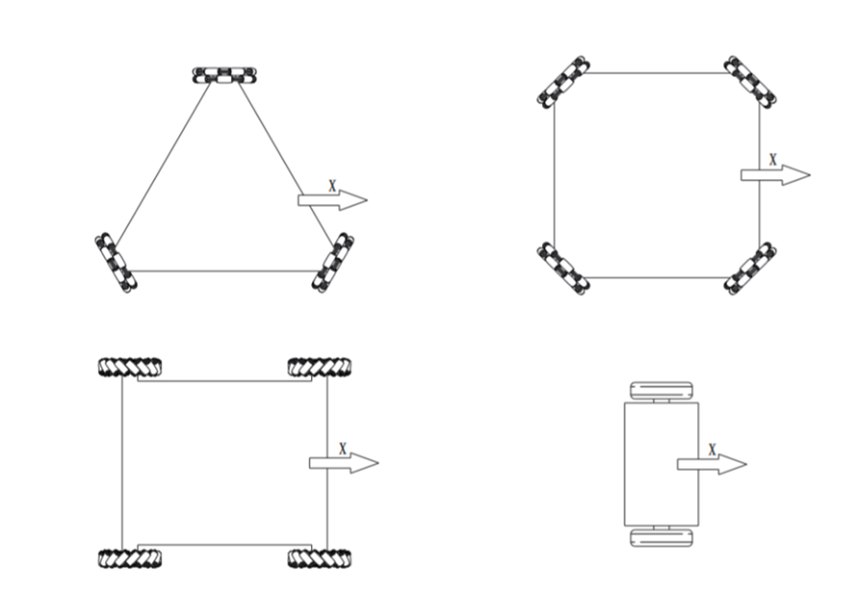

### 5.8.2

- 机器人进行装甲模块安装时，装甲模块和装甲支撑架需稳固连接。装甲模块的装甲支撑架底部连接面需与XY平面平行，使得装甲模块受力面所在平面的法向量所在直线与Z 轴负方向所在直线的锐角夹角为75°。装甲模块不含侧灯的两条边与 XY 平面夹角小于5°。定义安装好的装甲模块受击打面的法向量（与 Z 轴负方向夹角为锐角）在XY平面上的投影为该装甲模块的方向向量。4块装甲模块的方向向量需分别与机器人机体坐标系的正 X 轴、负 X轴、正 Y 轴、负 Y 轴一一对应，方向向量和对应坐标轴之间的角度误差不能超过5°。
- 机器人本身的运动学方程也需建立在上述机体坐标系下。装甲模块的安装方式需与机器人本身的结构特性或者运动学特性共享同一个参考坐标系。X轴上安装的装甲模块几何中心点连线与Y轴上安装的装甲模块几何中心点连线要互相垂直。装甲模块相对于机器人的几何中心的偏移量在X轴或Y轴上的分量不得超过30mm。
- 装甲支撑架可以选择官方装甲支撑架或自制，且安装好的装甲模块和装甲支撑架需与底盘刚性连接。比赛过程中，装甲模块与底盘不可发生相对移动。刚性连接定义如下图所示，向装甲模块下边缘中点施加一个竖直向上的20N 的力，装甲模块受击打面角度α变化不得大于5°。
- 若机器人底盘为平衡车构型，则只需要安装正 X 轴与负 X 轴方向上的装甲板模块。（平衡车构型：在90%的时间仅有两轮接触地面的底盘构型）

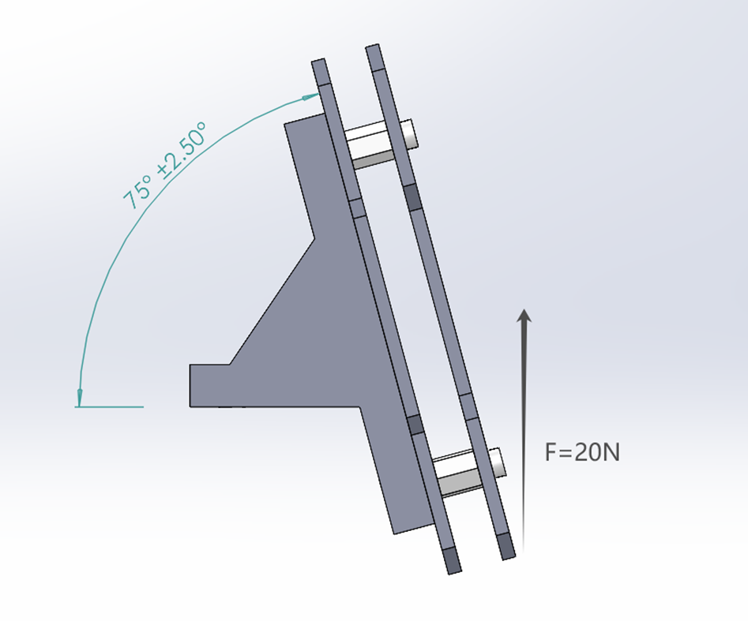

### 5.8.3 机器人变形

- 原则上，比赛开始后，任何一块装甲模块不能主动地相对于机器人整体的质量中心发生移动。如果参赛机器人因为机器人结构设计需求导致机器人具有可变形特性，其装甲模块需满足：任何时候，任何一块装甲模块不可相对于机器人底盘发生连续、往复的快速移动。快速移动定义为移动速度超过0.5m/s。

- 地面机器人任意两块装甲模块下边缘高度差不超过50mm。

- 对于地面机器人，变形前后，装甲模块下边缘距离地面高度必须在30mm~200mm范围内。

- 在设计装甲板支撑架安装孔位时应考虑避免装甲板受到撞击，在检录时若遇到装甲板面板破损将不予通过。

# 6. 学长导师制

为引导新生积极参与和降低入门门槛，本活动特别了设立学长导师制。具体规则如下：

- 每支队伍限最多2个导师，每个导师不限指导队伍数（颁导师奖只给所指导队伍中的最高奖）

- 学长导师仅仅提供技术、创意方向指导，不可以完全替代新生完成设计制作。

- 组委会将会在官方群内公布推荐的学长导师名单。同时，参赛队伍也可通过科协等渠道，去选择名单外的学长作为导师。

- 比赛不强制要求选择学长导师，不选择导师同样也可以报名参赛。

# 7. 开源审查

参赛队伍应具有自主设计的能力。组委会将会对每一支队伍进行审查，参赛队伍有义务向组委会展示机器人机械、电路设计图纸以及相关代码文件，并回答相关技术询问。组委会有权记录、保存参赛队伍的机器人相关构型和信息。**各参赛队伍需要在作品报告中明确指出机器上在相应区域采取了何种再设计，以便评测。**

## 7.1 充分再设计

能够领悟开源设计的设计意图，并能够在机械的构型、电控软硬件方案上进行优化和创新，例如：

- **轮组改变：** 麦克纳姆轮方案、全向轮方案、阿克曼方案 ……
- **电机改变：** 直流有刷、直流无刷、直驱电机、减速电机 ……
- **传动方式改变：** 直驱，减速，齿轮传动，同步带传动，连杆传动 ……
- **云台构型改变：** 增加 Yaw、Pitch、Roll 轴（其一即可） ……
- **电控硬件方案改变：** 更换其他型号的主板 ……
- **电控软件方案改变：** 更换代码开发框架，完全自主编写代码 ……
- **其他有助于比赛创新性设计：** 增加小陀螺模式，增加辅助自瞄系统 ……

## 7.2 非充分再设计

能够基本理解开源设计，但在原设计的基础上仅仅做出了对于某一模块尺寸、大小、同大类下的小类替换进行优化，或者对车组整体、车组对应模块的涂装、装饰性外形改变，例如：

- **轮组参数改变：** 轮径，轮宽 ……
- **联轴器类型改变：** 夹紧式联轴器，顶紧式联轴器，刚性联轴器，柔性联轴器 ……
- **整车涂装改变：** 整车颜色改变（但需符合机器人制作规范中的颜色要求） ……
- **有助于提升整车性能的材料更换：** 亚克力更换为玻纤板/碳板 ……
- **其他有创新性但对比赛帮助不大的设计**

## 7.3 无效再设计

看过开源，但是仅仅对模块进行材质上的替换等其他难以带来性能上的优化，例如：

- **不能提高整车性能的材料更换：** 用打印件替换亚克力板 ……
- **简单的型号替换：** 使用不同品牌的电机 ……
- **其他意义不大的设计**。

# 8. 裁判系统

各队伍制作的比赛小车需安装裁判系统，裁判系统由组委会统一设计并提供。各参赛队伍可赛前借用。具体要求如下：

- 裁判系统包括四块装甲板及一个图传模块。

- 不可自行修改裁判系统的软硬件，正式比赛需烧录比赛专用固件。

- 自制裁判系统不可参加比赛。

- 通过中期考察后可借用裁判系统（需缴纳押金）。

- 如果现场装甲板损坏，可以临时缴付押金再借一套。

- 成功完赛以后，可选择归还裁判系统退押金或者以折扣价购买。

- 若裁判系统发生损坏，组委会按照损坏程度从押金内扣除维修费。

### 8.1 装甲板模块

装甲板模块用于实时监测弹丸击打及物理碰撞，其核心技术规格如下：

- **检测机制**：系统检测频率为 **10Hz**。为防止信号叠加，当任意一块装甲板触发击打信号后，全车四块装甲板将进入 **100ms** 的静默期。
- **系统构成**：每套模块由 **4 块**装甲板组成，包含 **1 块主装甲板**及 **3 块从装甲板**。
- **供电要求**：装甲板主板需提供标准 **5V** 直流供电。
- **数据交互**：主板集成一路 **UART 串口**，用于向上位机或主控发送键盘、鼠标控制指令。

装甲板正面：

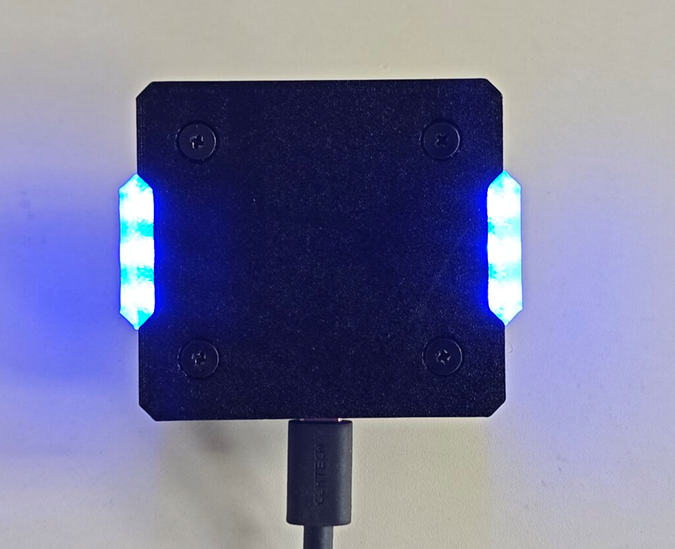

装甲板背面：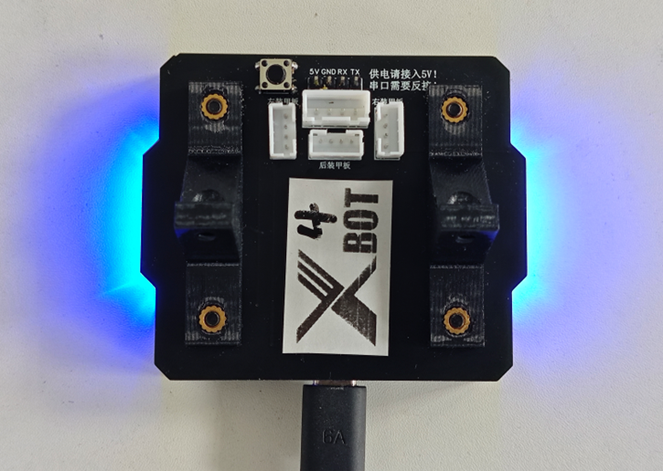

装甲板侧视图：

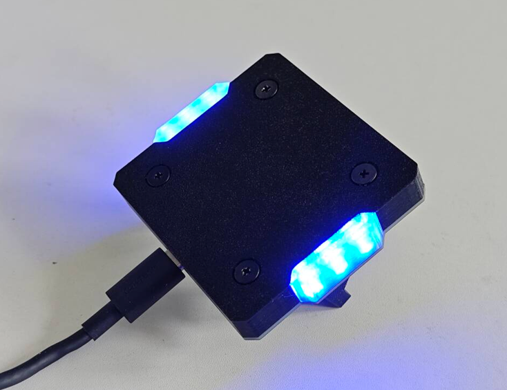

装甲板模块安装孔位：

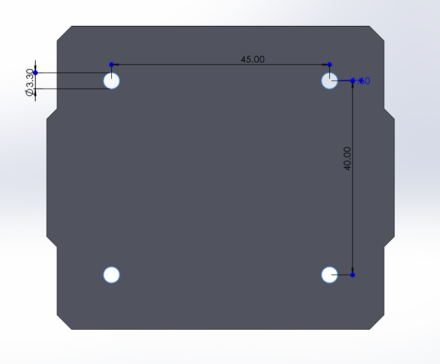

官方装甲板支撑架安装孔位：

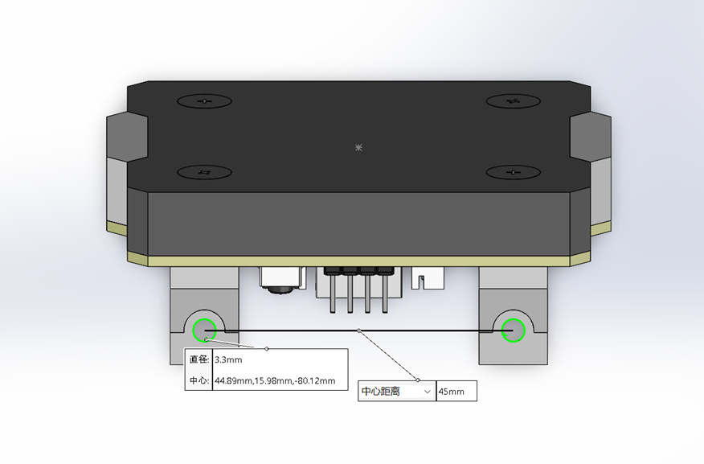

### 8.2 图传模块

图传模块负责将机器人第一人称视角（FPV）画面实时回传至操作端屏幕：

- **物理安装**：模块预装两颗 **M3 热熔螺母**用于紧固，标准孔距为 **30mm**。
- **供电方案**：
  - **内置电源**：模块自带独立电池，可自主供电。
  - **外部供电**：支持外部 **3.3V** 直流供电。
  - **⚠️ 警告**：**严禁使用 5V 供电**，**否则可能导致硬件永久性损坏。**

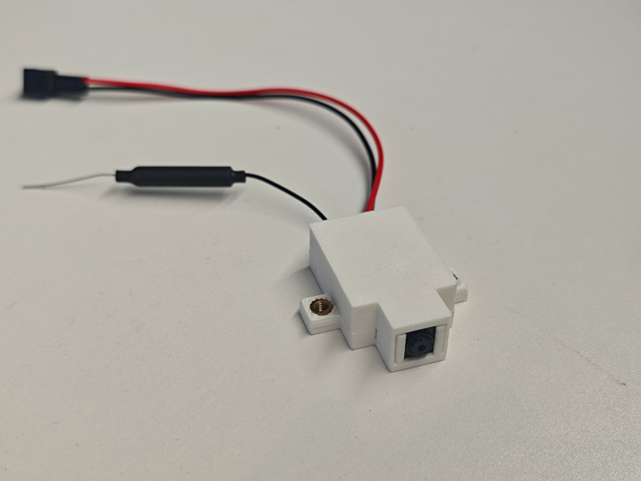

图传模块安装孔位：

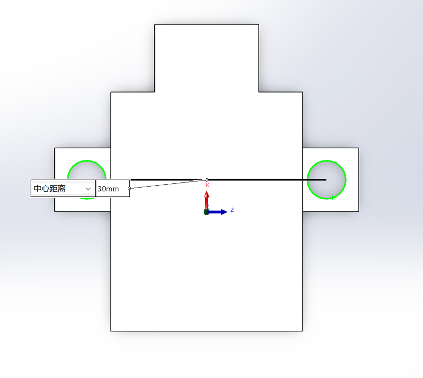
